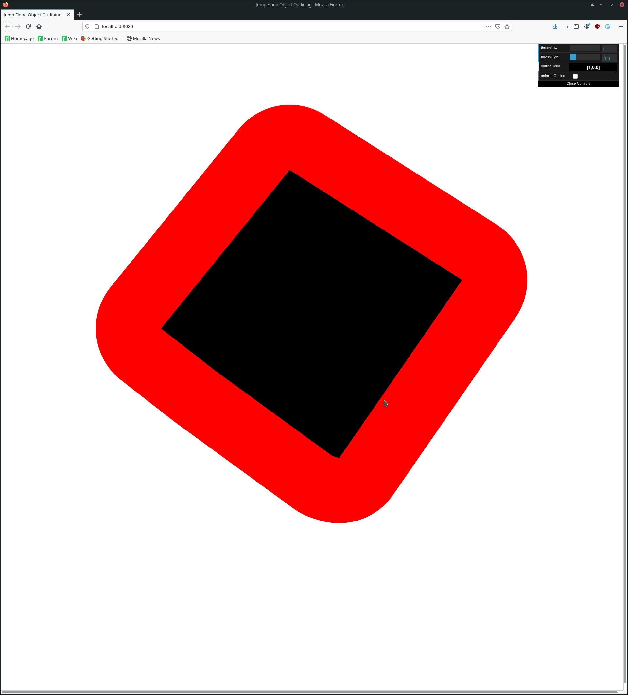

# Jump Flood Based Object Outlining for Three.JS

## Overview

An implementation of Jump Flood Based Object Outlining described [here](https://medium.com/@bgolus/the-quest-for-very-wide-outlines-ba82ed442cd9) by Ben Golus for Three.JS.



Run the example by doing the following:
1. Clone this repo.
2. In the root, run `npm link`
3. Change to the `example` sub directory.
4. Run `npm install`
5. Run `npm link three_js_outline`
6. Run `npm run start`

## Install

`npm install --save three_js_outline`

## Usage

In the default setup, the Three.JS layer system is used to mark an object for outlining.  

```
import { JFAOutline } from 'three_js_outline';

// By default we rely on the three js layer system to mark an object for outlining.
const SELECTED_LAYER = 1;

// We need two render targets to ping-pong in between.  
const targets = [];
for (let i = 0; i < 2; i++) {
  targets.push(
    new THREE.WebGLRenderTarget(WIDTH, HEIGHT, {
      type: THREE.FloatType,
      magFilter: THREE.LinearFilter,
      minFilter: THREE.LinearFilter,
    })
  );
}
```

In your render loop after the scene has been rendered normally, do the following:
`jfaOutline.outline(renderer, scene, camera, targets, iResolution, SELECTED_LAYER);`

`iResolution` is a Three.Vector2 that has the width and height of the screen for x & y.

If you need more control over the outlining, the following functions are available on jfaOutline:

* `renderSelected` this function renders all objects with SELECTED_LAYER set to the first render target in white on a black background.
* `renderDistanceTex` this renders the distance texture
* `renderOutline` this uses the distance texture to render the outline.
* `setOutlinePass` this allows one to set a custom outlining shader.

## TODO

More interesting outline shaders..  we have distance from edge to work with, we can do something cooler than just a normal outline!